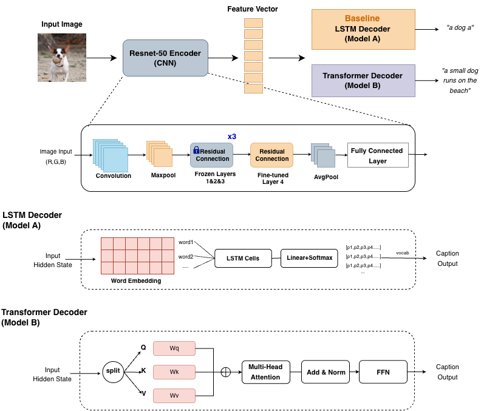
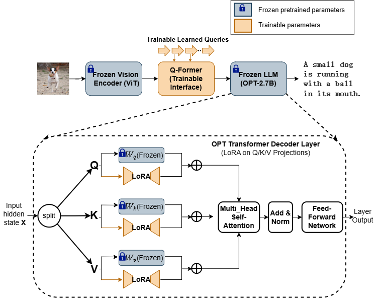
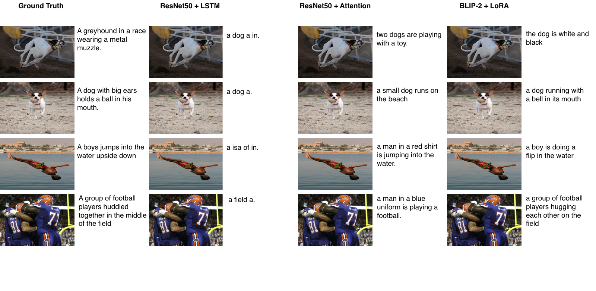

# Image Captioning on Flickr8k

This repository contains a comparative study of three image captioning models evaluated on the **Flickr8k** dataset.
The project investigates how different architectural choices—from CNN-based encoder–decoder models to pretrained vision–language models—affect caption quality under limited computational resources.

Each model is implemented in an independent Jupyter notebook and can be executed separately.

---

## Contents

- `ResNet50+LSTM_Flickr8k.ipynb`  
  CNN-based image captioning model with an LSTM decoder.

- `ResNet50+Transformer_Flickr8k.ipynb`  
  CNN-based image captioning model with a Transformer decoder.

- `BLIP2_LoRA_Flickr8k.ipynb`  
  Pretrained vision–language model (BLIP-2) adapted to image captioning using Low-Rank Adaptation (LoRA).

Each notebook is self-contained and corresponds to one model variant used in the comparison.

---

## Model Overview

The figures below illustrate the architectures of the evaluated image captioning models, including CNN-based baselines and the pretrained BLIP-2 model with LoRA-based parameter-efficient fine-tuning.

**CNN-based and Transformer-based captioning architectures**

**BLIP-2 architecture with LoRA-based adaptation**

---

## Dataset

All experiments are conducted on the **Flickr8k** dataset.

Please manually download the dataset from Kaggle:

👉 https://www.kaggle.com/datasets/adityajn105/flickr8k

After downloading, extract the dataset to a local directory or to Google Drive if using Google Colab.

### Important Note on Paths

The dataset paths in the notebooks are configured according to the original author's directory structure.
To reproduce the experiments, you **must manually update all dataset-related paths** in each notebook to match your own setup.

This typically includes:
- Image directory paths
- Caption annotation file
- Train / validation / test split files

---

## Running the Code

To reproduce the results:

1. Download the desired `.ipynb` file from this repository.
2. Open it in **Google Colab** (recommended) or a local Jupyter environment.
3. Modify dataset paths according to your local or Colab setup.
4. Run all cells sequentially within the notebook.

Each notebook can be run independently; no additional scripts are required.

---

## Notebook Preview on GitHub

Due to limitations of GitHub’s notebook renderer, some Jupyter notebooks in this repository may not display correctly in the GitHub web preview (e.g., showing an *“Invalid Notebook”* message).

**This does not affect the correctness, executability, or reproducibility of the code.**

All notebooks can be successfully downloaded and executed in Google Colab or a local Jupyter environment.
The issue is related to metadata generated by interactive widgets in Colab and does not impact experimental results.

---

## Qualitative Examples

Below are example qualitative comparisons of generated captions across different models on the Flickr8k validation set.

---

## Environment

The notebooks were developed and tested using:

- **Google Colab**
- **NVIDIA A100 GPU**
- Python environment provided by Colab

For best reproducibility, running the notebooks on **Google Colab with GPU enabled** is recommended.
The BLIP-2 + LoRA notebook is the most computationally intensive and requires GPU support.

---

## Notes

- Minor variations in runtime or numerical results may occur due to differences in hardware or software environments.
- This repository is intended for educational and research purposes.
